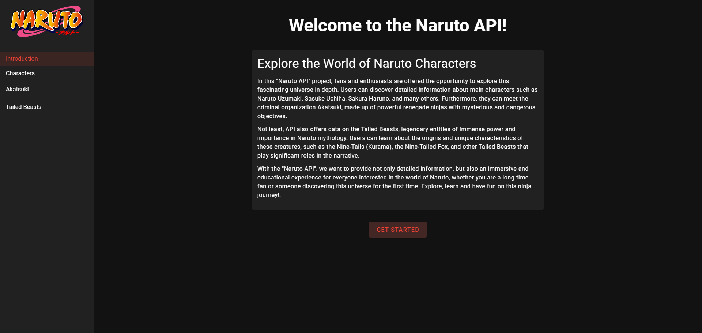

# Naruto API
Essa é uma aplicação web desenvolvida em Vue.js que permite aos usuários explorar informações relacionadas ao universo do anime Naruto. A aplicação consome a API "NarutoDB", fornecendo dados como todos os personagens, personagens da Akatsuki, Bestas de cauda, informações detalhadas de jutsus e outras informações relevantes de cada personagem.
<br>
<br>


# Introdução
Bem-vindo ao "Naruto API", uma aplicação criada para os fãs de Naruto explorarem informações detalhadas sobre o universo do anime. Esta aplicação web foi desenvolvida em Vue.js, utilizando Vite para a construção rápida e eficiente do projeto, e Vuetify para uma interface elegante e responsiva.
<br>
<br>
Você pode acessar e testar a aplicação hospedada na Vercel **[clicando aqui.](https://naruto-api-viniciusquintas-projects.vercel.app/)** 

# Design e Funcionalidades
A aplicação apresenta uma interface intuitiva e fácil de usar, com as seguintes funcionalidades:

- **Página de Introdução:** Apresenta uma introdução ao projeto e sua funcionalidade principal.
- **Página "Characters":** Exibe todos os personagens do anime Naruto, permitindo busca por nome e detalhes sobre cada personagem.
- **Página "Akatsuki":** Lista todos os personagens da organização criminosa Akatsuki, com informações detalhadas sobre cada membro.
- **Página "Tailed Beasts"**: Apresenta as Bbstas de cauda do anime, com informações sobre cada uma delas.
Além disso, a aplicação utiliza o Axios para realizar o consumo da API "NarutoDB" de forma eficiente e organizada. As informações são apresentadas em cards responsivos, proporcionando uma experiência de usuário agradável.

# Tecnologias Utilizadas
O projeto foi construído utilizando as seguintes tecnologias:

- **Vue.js:** Framework JavaScript para construção de interfaces de usuário dinâmicas.
- **Vite:** Build tool rápida e eficiente para projetos Vue.js.
- **Vuetify:** Biblioteca de componentes Vue.js para design responsivo e moderno.
- **Axios:** Cliente HTTP para realizar requisições à API de forma simplificada e organizada.

# API
A aplicação consome a API "NarutoDB" para obter informações sobre personagens, Akatsuki, Tailed Beasts, jutsus e outras informações do anime Naruto. A API oferece endpoints para diferentes tipos de consultas, possibilitando uma ampla gama de informações sobre o universo de Naruto.
<br>
<br>
Para mais detalhes sobre a API "NarutoDB", consulte a documentação oficial em [https://narutodb.xyz/docs](https://narutodb.xyz/docs).

# Estrutura do Projeto
O projeto "Naruto API" está estruturado da seguinte forma:

- **Pasta components:** Contém componentes reutilizáveis utilizados em diferentes partes da aplicação.
    <br>
    <br>
  - **FormComponent:** Componente para a barra de pesquisa e filtragem de dados.
    <br>
  - **HeaderComponent:** Componente do menu de navegação lateral.
    <br>
  - **ItensComponent:** Componente para exibição dos itens em cards responsivos.

<br>

- **Pasta pages:** Contém as páginas principais da aplicação.
    <br>
    <br>
  - **index.vue:** Página de introdução do projeto.
    <br>
  - **Characters.vue:** Página para exibir todos os personagens do anime.
    <br>
  - **Akatsuki.vue:** Página para listar os personagens da Akatsuki.
    <br>
  - **Beasts.vue:** Página para apresentar as Tailed Beasts.
    <br>
    
Arquivo axios.js: Configuração do Axios para realizar as requisições à API "NarutoDB".


# Como executar o projeto
Para utilizar esse projeto na sua máquina local siga estas etapas:
- Certifique-se de ter o **Node.js** e o **npm** instalados em sua máquina.
- Clone o repositório para sua máquina local utilizando o seguinte comando:
```bash
  git clone https://github.com/ViniciusQuintas/naruto-api.git
```
- Após clonar o repositório, navegue até o diretório do projeto no terminal:
```bash
  cd naruto-api
```
- Instale todas as dependências do projeto listadas no arquivo `package.json` com o seguinte comando:
```bash
  npm install
```
- Após a instalação das dependências, execute o seguinte comando para para iniciar o servidor de desenvolvimento.
```bash
  npm run dev
```
- Por fim, abra o navegador e acesse `http://localhost:3000` para visualizar a aplicação.

# Contribuição
Se você deseja contribuir para o desenvolvimento desse projeto, siga os seguintes passos:

 1️⃣ Faça um fork deste repositório. 
<br>
<br>
 2️⃣ Crie uma nova branch para sua contribuição. 
<br>
<br>
 3️⃣ Faça suas alterações no código. 
<br>
<br>
 4️⃣ Certifique-se de que suas alterações não quebram o funcionamento existente do projeto. 
<br>
<br>
 5️⃣ Faça um pull request com suas alterações. 
<br>
<br>


# Licença
Este projeto está licenciado sob a Licença MIT. Consulte o arquivo LICENSE para obter mais informações.
